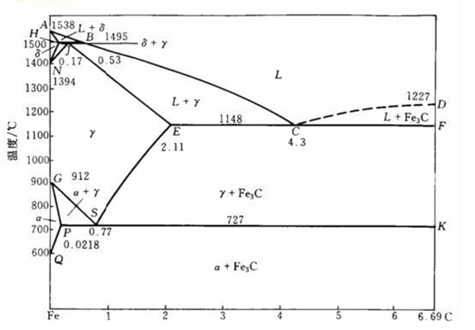
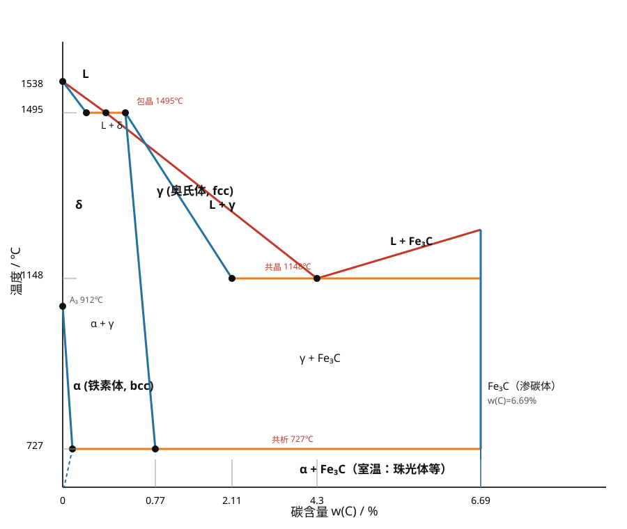
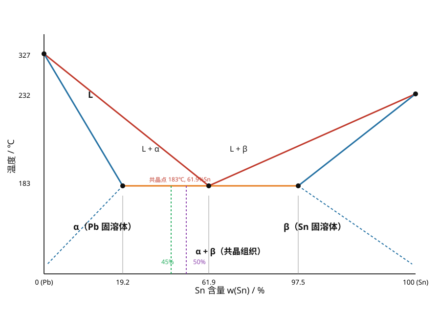

# 材料科学基础 · 复习笔记

> 依据《材料科学基础-2026复习.pdf》与《材料科学基础习题-2026.docx》整理。
> 全书 8 章：原子键合 → 晶体结构 → 晶体缺陷 → 塑性变形与再结晶 → 扩散 → 单元系相变 → 二元系相图 → 三元系相图。
> 复习主线：**背概念 → 记数字 → 会公式 → 能算题 → 会简答**。

---

## 第 1 章 原子键合

### 核心概念

**四个量子数**

| 量子数 | 符号 | 决定什么 |
| --- | --- | --- |
| 主量子数 | n | **电子能量及与核的平均距离** |
| 角量子数 | l | 轨道形状（亚层） |
| 磁量子数 | m | 轨道空间取向 |
| 自旋量子数 | ms | 电子自旋方向 |

电子排布时**优先排布在能量最低的轨道**（能量最低原理）。

### 键的类型

| 键型 | 本质 | 特点 |
| --- | --- | --- |
| 金属键 | 正离子 + 自由电子云（电子**共有化**，属所有原子共有） | 无方向性、无饱和性；导电导热好 |
| 共价键 | 相邻原子**共有价电子**（属若干原子共有） | 有方向性、饱和性；C-H 键是共价键 |
| 离子键 | 正负离子静电吸引 | 电负性差大 |
| 范德华力 | 分子间作用力 | **物理键**，很弱 |
| 氢键 | 分子间作用力 | 比范德华力强 |

**极化**：离子的变形（极化）使键性由**离子键向共价键过渡**，最终晶体结构类型发生变化。

### 记忆要点

- 物理键只有**范德华力**（氢键属于分子间作用力，可理解为弱键，但答题按讲义说法：物理键=范德华力）。
- 金属材料导电导热好；**聚乙烯塑料**等聚合物不导电不导热。
- 常见化学键归属：高分子中 C-H → 共价键；盐类 → 离子键；金属 → 金属键。

---

## 第 2 章 晶体结构

### 晶体 vs 非晶体

| 项目 | 晶体 | 非晶体 |
| --- | --- | --- |
| 原子排列 | **规则** | 无序 |
| 性质 | **各向异性** | **各向同性** |
| 熔点 | **固定** | 无固定熔点 |
| 相同点 | 都是固态物体 | |

**空间点阵**：由结点构成的空间总体。特点：**阵点周围环境都相同、在空间的位置一定**。

### 晶面指数 / 晶向指数（必考计算）

- 晶面指数（Miller 指数）求法：**截距取倒数 → 互质整数 → 加圆括号 (hkl)**
- 晶向指数：沿晶向取最近结点坐标差 → 互质 → 加方括号 [uvw]
- 晶面族 `{hkl}`、晶向族 `<uvw>`
- **立方晶系中，相同指数的晶面和晶向互相垂直**（如 (111)⊥[111]）

例题：

- 截距 3a、2b、c → 倒数 1/3、1/2、1 → 通分 ×6 → **(236)**
- 截距 a、2b、2c → 倒数 1、1/2、1/2 → ×2 → **(211)**

### 晶胞与堆积（数字必背）

| 结构 | 每晶胞原子数 | 堆积系数 | 配位数 |
| --- | --- | --- | --- |
| 体心立方 bcc | **2** | **68%** | 8 |
| 面心立方 fcc | **4** | **74%** | 12 |
| 密排六方 hcp | 6 | **74%** | 12 |

口诀：**bcc 两个 68，fcc 四个 74，hcp 六个 74**。

- 等径球紧密堆积：
  - **六方最紧密堆积 = ABAB…**
  - **面心立方（立方最紧密）= ABCABC…**
- 紧密堆积产生两种间隙：**八面体间隙由 6 个球围成，四面体间隙由 4 个球围成**。
- 金刚石 vs 石墨：同为碳原子，硬度天差地别，原因是**晶体结构不同**（不是成分、组织、工艺）。

---

## 第 3 章 晶体缺陷

### 缺陷分类（必考）

| 类别 | 维度 | 例子 |
| --- | --- | --- |
| 点缺陷 | 0 维 | **空位**、间隙原子、置换原子 |
| 线缺陷 | 1 维 | **位错** |
| 面缺陷 | 2 维 | **晶界**、相界、孪晶界 |

- 溶质/杂质原子使晶格常数**可能增大也可能减小**（看溶质原子大小，不能一概而论）。
- 氮、氧原子半径小，能挤入金属间隙 → 形成间隙固溶体。

### 固溶体 vs 化合物

| 概念 | 关键判据 |
| --- | --- |
| 间隙固溶体 | 小原子溶入后**仍保留大原子的点阵结构** |
| 间隙化合物（间隙相） | 小原子溶入后**改变了大原子的点阵结构，形成新相** |
| 正常价化合物 | 金属与电负性较强的 IVA、VA、VIA 族元素按**原子价规律**形成 |
| 电子化合物 | 按**电子浓度**规律形成，结构与 A、B 组元都不同 |

### 位错（本章重头戏）

- 位错性质：
  - 位错是**已滑移区与未滑移区的边界**；
  - 位错线**不一定是直线**；
  - **位错不能中断于晶体内部**（只能终止于表面、晶界或形成位错环）——这是常考的不正确项；
  - 柏氏矢量是点阵平移矢量（单位位错）。
- 位错类型：
  - 刃型位错：b ⊥ 位错线
  - 螺型位错：b ∥ 位错线
  - 混合型位错：b 与位错线**呈一定角度**
- **单位位错（全位错）**：

| 结构 | 单位位错 | 伯氏矢量大小 |
| --- | --- | --- |
| fcc | **a/2⟨110⟩** | **√2/2·a** |
| bcc | **a/2⟨111⟩** | **√3/2·a** |

- 全位错：b 等于点阵矢量或其整数倍，滑移后原子排列不变；不全位错：b 不是点阵矢量整数倍。
- 位错能量 **E ∝ b²**：两根同向同大小位错合并，b 加倍 → 能量为原来的 **4 倍**（常考简答）。
- 位错的运动：
  - **滑移**：切应力 τ 作用下沿滑移面运动（刃、螺、混合位错都能滑移）→ 永久变形
  - **攀移**：刃位错垂直滑移面的运动（借助热缺陷，空位/间隙原子增殖或消失）
  - **交滑移**：螺位错受阻后转到相交的另一滑移面上继续滑移
- **弗兰克-瑞德源**：两端被钉扎的位错段在切应力下弯曲、绕节点回转、正负螺位错抵消形成位错环，循环产生新位错环 → 位错增殖。
- 扩展位错：两个不全位错中间夹层错区，仍是线缺陷。

### 晶界与相界

- **小角度晶界：相邻晶粒位相差 < 10°**；大角度晶界：> 10°。
- **共格相界**：界面原子同时位于两相晶格结点上，两相晶格彼此衔接，界面原子为两相共有。

---

## 第 4 章 塑性变形与再结晶

### 滑移

- 塑性变形以**滑移为主**。
- 滑移系（滑移面 × 滑移方向）：

| 结构 | 滑移系数量 |
| --- | --- |
| fcc | 12 |
| bcc | 12（常答 48 个滑移系，考选择题记 12） |
| hcp | **3**（少，故 hcp 塑性差、易孪生） |

- **Schmid 定律**：分切应力 τ = σ·cosφ·cosλ，cosφ·cosλ 称为**取向因子（施密特因子）**，**45° 时最大为 0.5**。取向因子越大，分切应力越大。
- 软取向：滑移系与外力接近 45°（易滑移）；硬取向：偏离 45° 远（σs 大）。
- 几何硬化：滑移转动使晶面**越来越远离 45°**，滑移变难；几何软化：越来越接近 45°，变易。
- 切应力作用下，螺位错只能滑移（不能攀移）；刃位错才能攀移。

### 加工硬化与屈服

- **加工硬化（冷作硬化）**：冷塑变形增大 → 强度硬度↑、塑性韧性↓。
- 消除加工硬化：**再结晶退火**。
- **屈服现象解释**（两道理论，常考）：
  1. **柯氏气团（Cottrell 气团）**：溶质原子钉扎位错，挣脱需要大应力 → 上屈服点；挣脱后易动 → 下屈服点与平台。
  2. **位错增殖理论**：变形前可动位错密度低，需高应力维持应变速率（上屈服点）；变形开始后位错迅速增殖，应力突然下降（下屈服点）。

### 滑移 vs 孪生（6 条对比，常考）

| 项目 | 滑移 | 孪生 |
| --- | --- | --- |
| 位移量 | 原子间距的**整数倍** | **分数倍**（小于一个原子间距） |
| 位向 | 晶体位向不变 | 位向改变，与基体**镜面对称** |
| 临界切应力 | 小 | **大得多** |
| 变形速度 | 较慢 | **接近声速** |
| 变形量 | 大 | 小 |
| 结构倾向 | fcc 易滑移 | **hcp 易孪生** |
| 相同点 | 都通过位错运动实现 | |

### 回复 · 再结晶 · 晶粒长大（热加工过程）

| 阶段 | 组织变化 | 性能变化 |
| --- | --- | --- |
| 回复 | 晶粒形状不变，位错空位大量减少 | 强度硬度略降、塑性略升、**残余应力大大降低** |
| 再结晶 | 拉长/破碎晶粒 → 新的均匀细小**等轴晶** | 强度硬度明显下降、塑性韧性大增、**加工硬化消除、内应力全部消失** |
| 晶粒长大 | 晶粒明显长大变粗 | 强度、硬度、塑性、韧性**都显著降低** |

- 再结晶温度：纯金属 **T再 ≈ 0.4·T熔（K）**。
- **临界变形度**（约 2%～10%）：变形量很小（如 5%）时退火，只有局部形核 → 晶粒反而**极粗大**。80% 大变形 + 温度过高退火也会粗化。细化晶粒：**足够大变形（80%）+ 较低温度（如 150℃）退火**。
- **形变织构**：塑性变形使各晶粒滑移面/方向向主形变方向转动，形成择优取向。变形引起的叫变形织构；再结晶后仍保持择优取向的叫**再结晶织构**。
- 典型案例（高锰钢鄂板钢丝断裂）：冷拔钢丝有加工硬化强度高；被红热鄂板加热到再结晶温度以上后**发生再结晶、强度下降**，承受不住重量而断裂。

---

## 第 5 章 扩散

### 菲克定律（必背表达式）

- **菲克第一定律**（稳态扩散，浓度不随时间变）：J = -D·dρ/dx
- **菲克第二定律**（非稳态扩散，浓度随时间变）：∂ρ/∂t = D·∂²ρ/∂x²
- 误差函数解（渗碳计算用）：**(Ws − W) / (Ws − W0) = erf( x / (2√(Dt)) )**
  - Ws = 表面浓度；W0 = 初始浓度；W = 深度 x 处的浓度
- 稳态 = 各处浓度及浓度梯度**不随时间改变**。

### 扩散机制与规律

- 扩散机制：**间隙扩散**（C 在 Fe 中，最快）、空位扩散、直接换位扩散。
- **扩散驱动力 = 化学位梯度**（不是浓度梯度！）。
- 三条路径的扩散系数：**D表面 > D晶界 > D晶内**，即 DS > DB > DL。
- **柯肯达尔效应**：两侧原子扩散速率不等时，**原始界面移向扩散速率较大的一方**。若界面向 A 试样移动 → A 组元扩散速率更大。
- 上坡扩散：低浓度 → 高浓度（化学位驱动）；下坡扩散：高浓度 → 低浓度。
- 原子扩散：无新相产生；**反应扩散**：扩散使溶质浓度超过固溶体极限而**形成新相**。

### 影响扩散的因素

1. 晶体致密度越低扩散越快；
2. 温度越高扩散越快；
3. 间隙扩散比空位扩散快；
4. 表面、晶界扩散比晶内快；
5. 应力改变化学位，影响扩散方向；
6. 第三组元改变结合力与扩散激活能。

### 渗碳为什么选在奥氏体区（900～930℃）？

虽然 C 在 α-Fe（bcc）中的扩散系数比在 γ-Fe（fcc）中大 100 倍，但：
1. 奥氏体区温度高，加速扩散；
2. **C 在奥氏体中的溶解度远大于铁素体**——这是基本原因。

---

## 第 6 章 单元系相变原理

### 形核

- 凝固驱动力：液固自由能差；需要过冷。
- **均匀形核**：靠**结构起伏 + 能量起伏**，在过冷液相中自发形核。
- **非均匀形核**：依附**固态杂质表面或器壁**形核，界面能减小、形核功小，**更容易**，可在较小过冷度下获得较高形核率。
- 相同点：驱动力与阻力相同、临界半径相同、都要形核功、都要临界过冷度、形核率先随过冷度增加而增加。
- **临界晶核半径**：r* = 2σ·Tm / (Lm·ΔT)（σ 固液界面能，Lm 熔化热，ΔT 过冷度）
- **临界形核功**：ΔG* = 16πσ³ / (3ΔGv²)
- 临界核的界面能 = **3ΔG\***（ΔG* = 1/3 界面能项）——常考关系题。
- r = r* 时，体系的自由能变化 **大于零（= 形核功 ΔG*）**。
- **形核率随过冷度：先增加后降低**（驱动力↑ 但原子活动能力↓，两个因素竞争）。

### 界面与相变

- **光滑界面（小平面界面）**：原子尺度上光滑平整，液固截然分开；光学显微镜下呈曲折小平面。
- 一级相变：体积、熵、焓突变（奥氏体转变是**一级相变**）。
- **铸锭宏观组织三区**：表层细晶区（激冷非均匀形核）→ 柱状晶区（单向热流枝晶延伸）→ 心部等轴晶区（散热无方向性，各向等速长大）。
- 结晶潜热大部分通过液相散失 → 液面前沿过冷大 → **树枝晶**。
- 铝过冷度 ΔT=10℃ 时临界晶核 r* ≈ **10 nm**（用公式代 Tm=993K, Lm=1.836×10⁹ J/m³, σ=93 mJ/m² 算）。

---

## 第 7 章 二元系相图

### 基本概念

- **相**：同一聚集状态、同一晶体结构性质、以界面隔开的均匀组成部分。
- **组织**：若干相以一定数量、形状、尺寸、分布组合成的**具有独特形态**的部分。单相组织有双重身份；组织侧重微观结构，相侧重存在方式。
- **杠杆定律只能用于两相区**计算相对量。
- 平衡凝固：先凝固的固相中**高熔点组元含量较高**。
- 包晶转变 L + α → β：高熔点组元**由 α 向 β 内扩散**。
- 共晶两相共存条件：**同种原子在两相中的化学势相等**（如 α 中 Pb 的化学势 = β 中 Pb 的化学势）。
- 非平衡凝固：液固成分偏离相线，凝固在更低温度完成，成分不均匀（晶内偏析/枝晶偏析）。
- 枝晶偏析：非平衡凝固先凝固部分高熔点组元含量高，枝干与枝叶成分不同。
- 只有共析钢才有共析转变？**不对**。含碳 0.0218%～6.69% 的钢和铸铁冷却到 727℃ 时，奥氏体含碳量达到 0.77% 都会发生共析转变。

### 成分过冷（重要简答）

- 定义：凝固时溶质再分配使固液界面前沿溶质浓度变化，引起理论凝固温度改变，从而在界面前液相内形成过冷。
- 原因：液相溶质分布改变前沿凝固温度，实际温度低于溶质分布决定的凝固温度。
- 对界面形貌的影响：**成分过冷由小到大：平面状 → 胞状 → 树枝状**。

### Fe-Fe3C 相图（重中之重）

> 上图直接取自习题答案的原图；复习 PDF 里的同一张原图在 `images/Fe-Fe3C相图-复习PDF原图.png`。
> 配套综合题原图：`images/Fe-Fe3C-1.0C-结晶过程-原图.png`（1.0%C 过共析钢平衡结晶过程）、`images/Fe-Fe3C-1.0C-室温组织示意图-原图.png`（室温组织示意图）。
> 下面是我画的简化标注版，方便记忆关键点：

**三个关键温度**（口诀：**727 共析、1148 共晶、1495 包晶**）：

| 转变 | 温度 | 成分（wt%C） | 反应式 |
| --- | --- | --- | --- |
| 包晶 | 1495℃ | L 0.17、δ 0.09、γ 0.53 | L + δ → γ |
| 共晶 | 1148℃ | L 4.3、γ 2.11、Fe3C 6.69 | L → γ + Fe3C |
| 共析 | 727℃ | γ 0.77、α 0.0218、Fe3C 6.69 | γ → α + Fe3C（珠光体） |

**关键成分点**：0.0218%（α 最大溶碳）、0.77%（共析）、2.11%（γ 最大溶碳）、4.3%（共晶）、6.69%（Fe3C）。

**七类合金室温组织（必背）**：

| 类别 | 成分范围 | 室温组织 |
| --- | --- | --- |
| 工业纯铁 | w(C) ≤ 0.0218% | F + Fe3CIII |
| 亚共析钢 | 0.0218% ~ 0.77% | **P + F** |
| 共析钢 | 0.77% | **P（珠光体）** |
| 过共析钢 | 0.77% ~ 2.11% | **P + Fe3CII（网状）** |
| 亚共晶白口铸铁 | 2.11% ~ 4.3% | P + Fe3CII + Le′ |
| 共晶白口铸铁 | 4.3% | **Le′（莱氏体）** |
| 过共晶白口铸铁 | 4.3% ~ 6.69% | Fe3CI + Le′ |

**渗碳体的三种形态（易混）**：

| 名称 | 来源 | 形态/影响 |
| --- | --- | --- |
| 一次渗碳体 Fe3CI | 共晶转变（液相析出） | 连续分布（莱氏体基体，鱼骨状） |
| 二次渗碳体 Fe3CII | 奥氏体析出 | **网状，使脆性增大、强度塑性韧性降低** |
| 三次渗碳体 Fe3CIII | 铁素体析出 | 短棒状/片状，微量 |

- **珠光体 = 铁素体 + 渗碳体，包含两种相**（选择题常考：哪种组织含两相 → 珠光体）。
- 渗碳体：Fe 与 C 形成的复杂晶格间隙化合物，硬度高、塑性差（延伸率≈0）。
- 0.45%C 合金：少量共析渗碳体（片状，强化基体）+微量三次渗碳体；3.0%C 合金：大量共晶渗碳体（连续分布）+少量二次渗碳体（网状，降低强度）+共析渗碳体。

### 杠杆定律例题（Pb-Sn，45%Sn @183℃）

已知：α 端点 19%Sn、共晶点 61.9%Sn、β 端点 97.5%Sn。

- 先共晶 α初 = (61.9−45)/(61.9−19) ×100% = **38.3%**；共晶 (α+β) = **61.7%**
- α 相总量 = (97.5−45)/(97.5−19) ×100% = **67%**；β 相 = **33%**

50%Sn 合金：α初 ≈ 28%，(α+β)共 ≈ 72%；α 相 60.5%，β 相 39.5%。室温平衡组织：**α初 + (α+β)共 + βⅡ**。

### 渗碳时间计算示例

950℃ 渗碳，0.1mm 深处要 0.9%C，表面 1.20%C，D = 10⁻¹⁰ m²/s：

(1.20 − 0.9)/(1.20 − 0) = erf(x/2√(Dt))，查误差函数表解得 **t ≈ 327 s（约 7.9 min）**。

### 过共析钢平衡结晶过程（1.0%C）

L → L+γ → γ → γ+Fe3CII → **P + Fe3CII（网状）**

---

## 第 8 章 三元系相图

- **恒压相律**：F = C − P + 1 = 4 − P，F=0 时 **Pmax = 4**（三元合金最多四相共存）。
- 三相区等温截面：**连接的三角形，顶点触及单相区**（相区接触法则：相邻相区相数差 1）。
- **垂直截面图**：可分析材料的**平衡凝固过程**，但**不能用杠杆定律**计算各相相对量（成分未知）。
- 三元共晶四相平衡区：形状为**三角形**；**上方连 3 个三相区**（L+α+β、L+β+γ、L+α+γ），**下方连 1 个三相区**（α+β+γ）；不与两相区或单相区相连（相数差 1）。
- 计算题套路（杠杆定律在直线上的投影）：已知 WB/WL、液相 B 含量、A/C 比值，联立解得合金成分。
  - 例：WB/WL = 2 = (XB−40)/(100−XB) → XB = 80%；X A + X C = 20% 且 XA/XC = 3 → **K 合金 = 15%A + 80%B + 5%C**。

---

## 全书速记卡（考前 10 分钟）

**数字类**

| 数字 | 含义 |
| --- | --- |
| 2 / 4 / 6 | bcc / fcc / hcp 每晶胞原子数 |
| 68% / 74% | bcc / fcc（hcp）堆积系数 |
| 3 / 12 / 12 | hcp / fcc / bcc 滑移系 |
| 45° | Schmid 取向因子最大 0.5 |
| 0.4 Tm | 纯金属再结晶温度（K） |
| 2%～10% | 临界变形度（退火晶粒粗大） |
| <10° / >10° | 小角度 / 大角度晶界 |
| 727 / 1148 / 1495℃ | 共析 / 共晶 / 包晶 |
| 0.77 / 2.11 / 4.3 / 6.69% | 共析 / γ最大溶碳 / 共晶 / Fe3C 含碳 |
| √2/2 a、√3/2 a | fcc、bcc 单位位错 b 大小 |
| 4 倍 | 两根同向位错合并后能量 |
| 327 s | 950℃ 渗碳例题时间 |
| 10 nm | 铝 ΔT=10℃ 临界晶核半径 |

**易混对比一句话**

- 晶体各向异性有固定熔点；非晶体各向同性无固定熔点。
- 间隙固溶体保留大原子点阵；间隙化合物改变点阵形成新相。
- 滑移位向不变、整数倍原子间距；孪生位向改变成镜面对称、分数倍位移。
- 再结晶消除加工硬化；回复主要消除残余应力。
- 上坡扩散去高化学位（低浓度→高浓度），下坡扩散相反。
- 反应扩散有新相，原子扩散无新相。
- 柯肯达尔界面移向扩散快的一方。
- 共析转变不是共析钢专利，0.0218%～6.69% 都会发生。
- 三元垂直截面能看凝固过程，不能算杠杆。

---

## 高频简答题速答清单

1. **渗碳为何选奥氏体区**：溶解度大 + 温度高加速扩散。
2. **屈服现象**：柯氏气团钉扎 + 位错增殖导致应力降落。
3. **钢丝断裂**：加工硬化的钢丝被加热发生再结晶，强度骤降。
4. **均匀 vs 非均匀形核**：非均匀形核借助杂质/器壁，界面能小、形核功小，更易。
5. **成分过冷对界面影响**：平面 → 胞状 → 树枝状。
6. **铸锭组织**：表层细晶 + 柱状晶 + 心部等轴晶。
7. **滑移 vs 孪生**：见第 4 章 6 条对比表。
8. **几何硬化 vs 软化**：转动后远离 45° 变难（硬化）；接近 45° 变易（软化）。
9. **弗兰克-瑞德源**：钉扎位错弯曲 → 绕节点回转 → 抵消成环 → 循环增殖。
10. **影响扩散因素**：致密度、温度、机制、路径、应力、第三组元。
